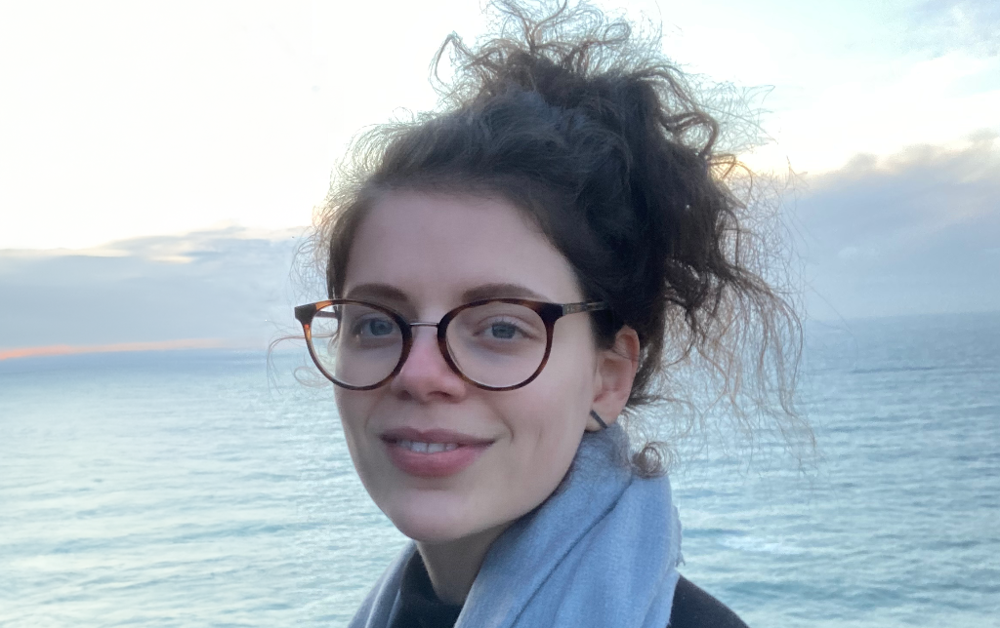

---
#
# By default, content added below the "---" mark will appear in the home page
# between the top bar and the list of recent posts.
# To change the home page layout, edit the _layouts/home.html file.
# See: https://jekyllrb.com/docs/themes/#overriding-theme-defaults
#
layout: page
---

I'm a fourth-year doctoral student at the Division of [Robotics, Perception and Learning (RPL)](https://www.kth.se/is/rpl/division-of-robotics-perception-and-learning-1.779439) under the supervision of [Professor Danica Kragic](https://www.csc.kth.se/~danik/).

I envision a future where robots are ubiquitous and capable of complex reasoning and manipulation tasks in unstructured, highly-variable environments. My research lies at the intersection of robotics and machine learning, focusing on the adaptive manipulation of Cloth-like Deformable Objects (CDO). This under-explored area requires novel approaches for the characterization, perception, modeling, and control of CDOs. I develop methods to characterize and perceive these objects, learning representations that account for their physical properties and advancing generalization techniques for learning-based dynamics and planning suitable for robotic manipulation. Additionally, I am currently exploring the use of foundation models to enhance the perception and manipulation of cloth-like objects, aiming to equip robots with enhanced adaptive skills.

---

### Professional Service

  * PhD Representative - Member of the EECS PhD school council 2023 - Now
  * Co-Organizer of ICRA 2024 workshop on [Representing and Manipulating Deformable Objects](https://deformable-workshop.github.io/icra2022/)

---

### Reviews

  * Reviewer for IROS 2022 - Now
  * Reviewer for ICRA 2022-Now
  * Reviewer for ICRA 2022-Now workshop on [Representing and Manipulating Deformable Objects](https://deformable-workshop.github.io/icra2022/)

---

### Contact


**Calendar**: [Free/busy Calendar](https://calendar.google.com/calendar/embed?src=zerickso%40andrew.cmu.edu&ctz=America%2FNew_York&mode=WEEK)  
Please check my calendar to see if I am available prior to suggesting a meeting time.


**Email**: albertal@kth.se

**Office**: Teknikringen 14, Room 712.

**Address**  
KTH Royal Institute of Technology  
Division of Robotics, Perception, and Learning (RPL)  
School of Electrical Engineering and Computer Science  
Teknikringen 14, 7th floor, SE-100 44 Stockholm, Sweden  

---

### Teaching Assistant

Fall 2022: [Image Analysis and Computer Vision (DD2423)](https://www.kth.se/social/course/DD2423/)  
Fall 2022: [Introduction to Robotics (DD2410)](https://www.kth.se/social/course/DD2410/)

